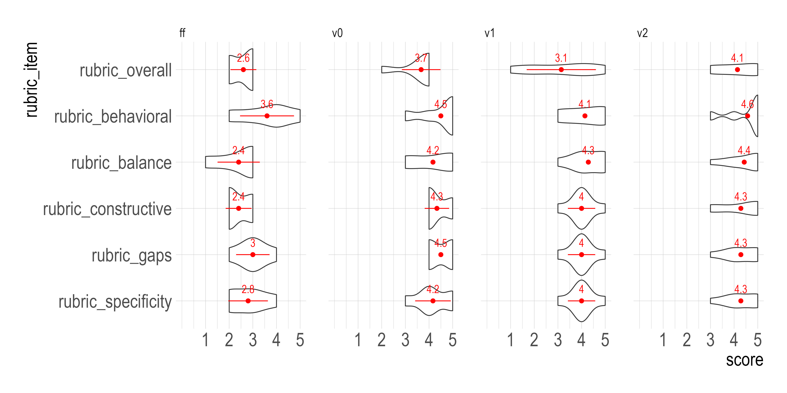

## {background-image="img/human-ai-exams.png" background-size="contain"}

Excellent job.

Excellent clinical reasoning. Explain your thought process in plain terms to the patient.

Your clinical reasoning was excellent based on the way you approached history taking to discover the three plausible differential diagnoses. However, I did not hear you spend enough time discussing your reasoning to your patient in plain terms, which can help reduce their anxiety and improve their compliance with testing and treatment. Continue to refine your communication skills by practicing...

## Background {auto-animate="true"}

How to define &ldquo;good&rdquo; LLM feedback

  1
  Align with faculty
  Prompt and rate LLMs for feedback that closely matches what faculty wrote.
  (Shakur et al., 2024; R&uuml;dian et al., 2025)

  Our research
  2
  Align with pedagogy
  Prompt and rate LLMs for feedback that aligns with best assessment practices and feedback science. Rate faculty feedback independently.
  (Dai et al., 2024; Hattie &amp; Timperley, 2007; K&#x131;yak et al., 2026)

## OSCE Rubric {auto-animate="true"}

How to assess students

38
Checkboxes
Done or Not Done, from washing hands to listening to both lungs to the teach-back. They average into a score and decile.

4
Global ratings
History, physical exam, clinical reasoning, and communication &mdash; each judged against expectations for this level of training.

1
Paragraph of formative feedback
A short written comment about the student's performance.

## Quality of Feedback Rubric {auto-animate="true"}

How to assess feedback

Specific
Names the behavior and the gap between current and expected performance
(Hattie &amp; Timperley, 2007; Wisniewski et al., 2020)

Constructive
Gives the student something actionable to do next time
(Hattie &amp; Timperley, 2007; Lefroy et al., 2015)

Balanced
Covers strengths and gaps, not only what went wrong
(Lefroy et al., 2015)

Behavioral
Describes observed actions, not personal attributes
(Ende, 1983; Alsahafi et al., 2023)

Accurate
LLM feedback shows variable accuracy. A confident wrong claim can harm learning or care.
(K&#x131;yak et al., 2026)

## Feedback Generation {auto-animate="true"}

Role-based, zero-shot prompting

Processed in Python via Whisper and generated in R via Azure AI Foundry (ZDR) with Claude Opus 4.8

<svg viewBox="0 0 24 24" aria-hidden="true"><rect x="2.5" y="6" width="13" height="12" rx="2.5"/><path d="M15.5 11l6-3.5v9l-6-3.5z"/></svg>
OSCE video

<svg viewBox="0 0 24 24" aria-hidden="true"><path d="M4 12h15"/><path d="M13 6l6 6-6 6"/></svg>

<svg viewBox="0 0 24 24" aria-hidden="true"><path d="M4 10v4M8 6v12M12 3v18M16 7v10M20 10v4"/></svg>
Audio

<svg viewBox="0 0 24 24" aria-hidden="true"><path d="M4 12h15"/><path d="M13 6l6 6-6 6"/></svg>

<svg viewBox="0 0 24 24" aria-hidden="true"><path d="M6 3h8l4 4v14a1 1 0 0 1-1 1H6a1 1 0 0 1-1-1V4a1 1 0 0 1 1-1z"/><path d="M14 3v4h4"/><path d="M8.5 9.5h3M8.5 13h7M8.5 16.5h7"/></svg>
Transcript

V0
No case context
Role, task, inference guardrails, and feedback rules &mdash; nothing about the case itself.

V1
Generic reasoning
Adds the case context and a general clinical reasoning scaffold.

V2
Case-specific reasoning
Adds a case-specific reasoning scaffold with the expected differentials.

## Rating Design {auto-animate="true"}

How the feedback was rated

Pilot to test the workflow and the instrument before scaling to 130 transcripts

5
Blinded raters
Faculty/staff rate each comment without knowing whether an LLM or a colleague wrote it.

4
Conditions
The three prompt versions &mdash; V0, V1, V2 &mdash; and faculty feedback.

25
Pilot ratings
5 transcripts stratified across deciles &times; 5 raters.

::: {.matrix .fragment}
| Transcript | Rater 1 | Rater 2 | Rater 3 | Rater 4 | Rater 5 |
|---|---|---|---|---|---|
| T1 | V0 | V1 | V2 | FF | V2 |
| T2 | V1 | V2 | FF | V0 | V0 |
| T3 | V2 | FF | V0 | V1 | V2 |
| T4 | FF | V0 | V1 | V2 | V1 |
| T5 | V1 | V0 | V2 | FF | V1 |

: {tbl-colwidths="[20,16,16,16,16,16]"}

[Counterbalanced across raters, so one condition repeats per transcript. FF = faculty feedback.]{.cite}
:::

## Review Example {auto-animate="true" data-footer="false"}

<iframe srcdoc-file="review_example.html" style="width:100%; height:75vh; border:1px solid #ccc;"></iframe>

## Results {auto-animate="true"}

## Conclusions and Future Directions {auto-animate="true"}

What comes next

1
Polish the output
A second pass for accuracy

2
Full review
Scale the rating to all 130 transcripts, analyze feedback quality across conditions, and estimate inter-rater reliability.

3
Prospective study
Students rate the feedback, report their attitudes and trust in AI, and write a learning plan.

Thank you!

## {.thanks-slide auto-animate="true"}

Thank you!

